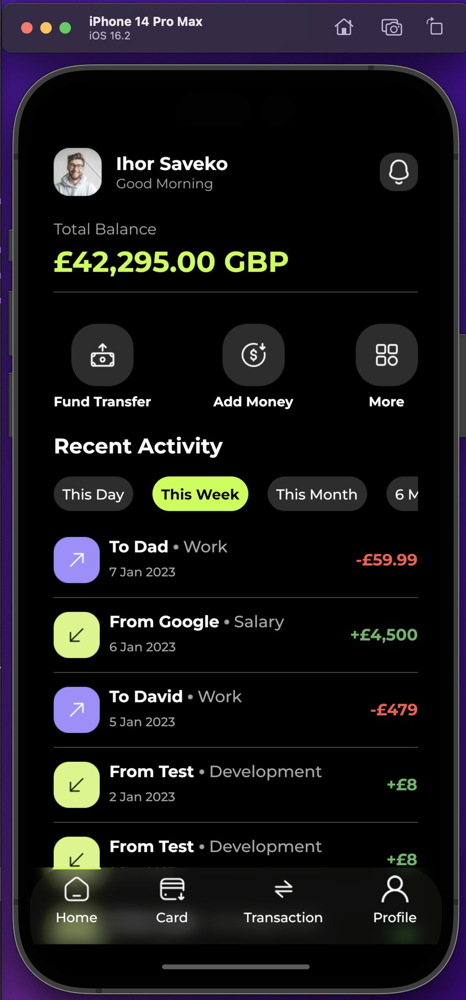
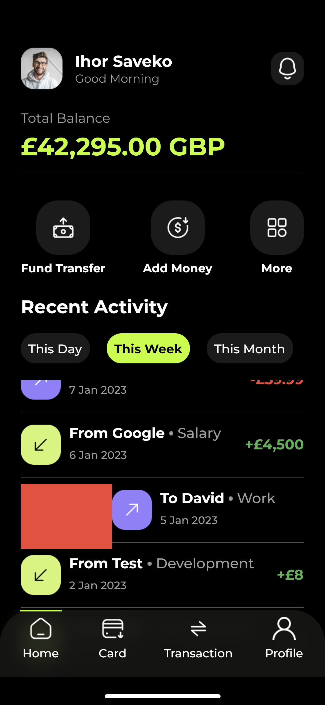

# hbank

## Run HBank on your iOS device/simulator from source code
> [!NOTE]
> For start confirm flutter instalation on your machine.
> bottom navbar opacity are adjustable
``` Bash
 git clone https://github.com/denver-code/hbank
 cd hbank
 flutter pub get
 flutter run 
```  
## Simulator demo


## iPhone demo

